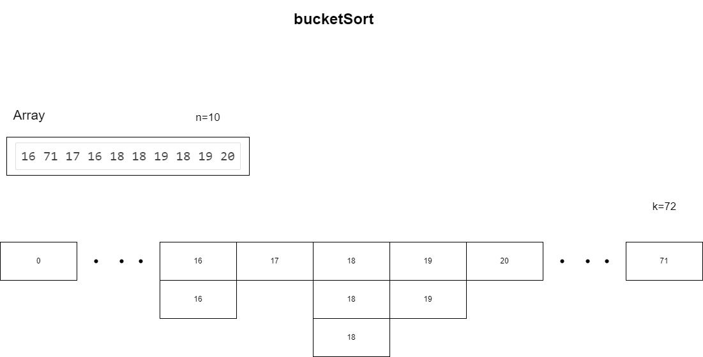

桶排序需要额外的存储空间存放重复的元素，空间复杂度为O(n+k)(k为桶的大小，n为输入数据的大小)，下图中是桶排序的存储结构，重复元素采用了动态数组存放。实际上，可以用更少的桶来进行存储，可以将每个元素除以5来确定它被分到哪个桶中。这样，每个桶中可能会有多个元素，因此我们需要对每个非空桶中的数据进行排序。



实现算法如下所示：

```cpp
void bucketSort(int arr[], int maxVal, int n) {
    int* bucket = new int[maxVal+1];
    for (int i = 0; i < n; i++) {
        /* 把元素装入桶中 */
        bucket[arr[i]]++;
    }
    for (int i = 0; i <= maxVal; i++) {
        /* code */
        if(bucket[i] > 0) {
            cout << i << " " << bucket[i] << endl;
        }
    }
}
```

#### Comments

桶排序是一种线性时间复杂度的排序算法，适用于输入数据服从均匀分布的情况

桶排序的时间复杂度为O(n)，空间复杂度为O(n+k)，其中k为桶的数量

桶排序是一种稳定的排序算法。但是，它的稳定性取决于用于对每个桶中的数据进行排序的排序算法。

