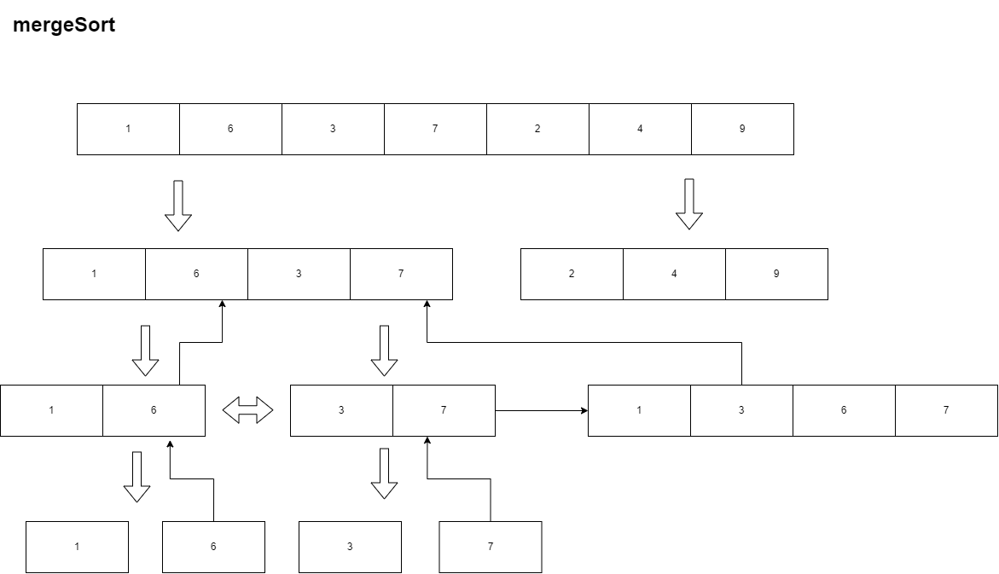

如图所示为原始归并排序的一次过程，(1,3,6,7)合并完后从额外数组赋值给原数组



Codes:


```cpp
// l1(数组1的开始下标) l2(数组2开始下标) end(数组2结束下标)
void mergeArray(int arr[], int temp[], int l1, int l2, int end) {//O(n)
    int i = l1, j = l2;
    int k = 0;
    while(i < l2 && j <= end) {
        if(arr[i] <= arr[j]) {//确保稳定性
            temp[k++] = arr[i++];
        } else {
            temp[k++] = arr[j++];
            //cnt += l2 - i;// 当数组1元素大于数组2中的元素时，数组1后续元素一定大于当前元素，即逆序数=后续元素个数
        }
    }
    while(i<l2) {
        temp[k++] = arr[i++];
    }
    while(j<=end) {
        temp[k++] = arr[j++];
    }
    for (int i = 0; i < k; i++) {
        /* code */
        arr[i + l1] = temp[i];
    }
}

void mergeSort(int arr[], int temp[], int left, int right) {
    if(left >= right) return;
    int mid = (left + right) / 2;
    mergeSort(arr, temp, left, mid);
    mergeSort(arr, temp, mid + 1, right);
    mergeArray(arr, temp, left, mid + 1, right);
}
```

#### Comments

- 归并排序是一种基于分治思想的排序算法，平均时间复杂度是O(nlogn)，最坏情况也是O(nlogn)，空间复杂度O(n)，是一种稳定的排序算法。

- 归并排序可以处理超大规模的数据集，但不适合小规模数据，因为归并排序过程涉及到递归调用和数组拷贝。

- 一般来说，归并排序需要一个额外的数组来存放合并后的结果，这样才能保证合并的过程是线性时间复杂度的。如果想要边归并边存放到原数组中，就需要在合并的过程中移动元素，这样会增加时间复杂度。

  
