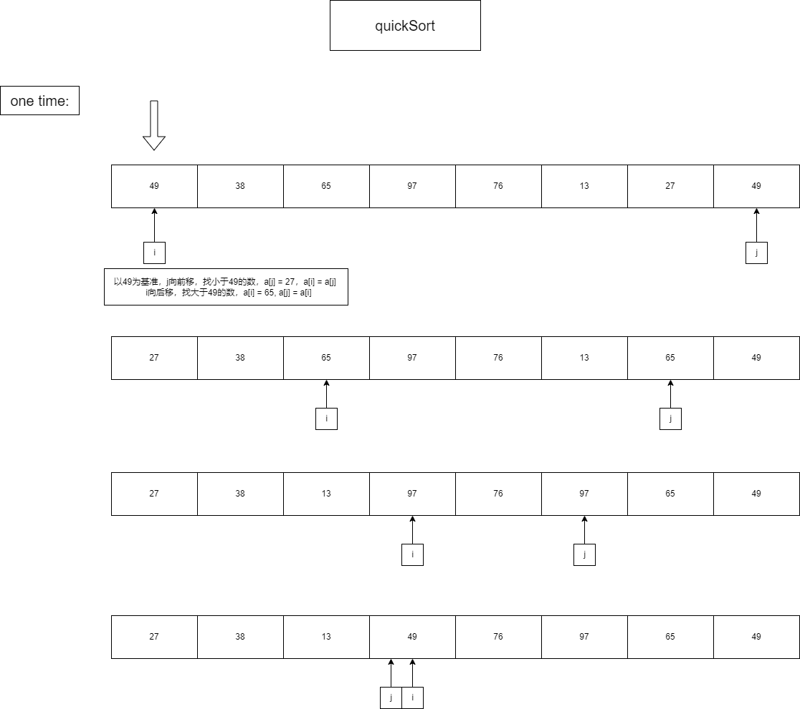

快速排序一次过程如图所示：



快速排序的算法简单实现如下所示：
```cpp
void quickSort(int arr[], int l, int r) {
    if(l >= r) return;
    
    int key = arr[l];
    int i = l, j = r;
    while(i < j) {
        while(i < j && arr[j] >= key)
            --j;
        arr[i] = arr[j];
 
        while(i < j && arr[i] <= key)
            ++i;
        arr[j] = arr[i];

    }
    arr[i] = key;
    quickSort(arr, l, i-1);
    quickSort(arr, i+1, r);
}
```

#### Comments

快速排序还是有点复杂的，主要采用了分治的思想，快速排序每次划分成[l, i-1]，[i+1, r] (  l<= i <= r )两部分，所以边界存在 l>r 和 l == r 的两种情况，两种都要返回。

快速排序平均时间复杂度为O(nlogn)，空间复杂度为O(logn)（递归深度为O(logn)）它是一种不稳定的算法，即排序后相同元素的顺序不一定和排序前的顺序一致。

快速排序适用于数据量大且数据分布随机的场景。上图是一种较好的情况，划分成了相等的两部分，如果每次都可以这样，则时间复杂度为O(nlogn)。但是，如果待排数组是有序的，每次划分将划分成1和n-1大小的两份，这样就退化成了递归版的冒泡排序，时间复杂度为O(n<sup>2</sup>)。

快速排序有很多改进版本，以上是一种基本的实现方式，如随机选择基准数，取中间数为基准数。
