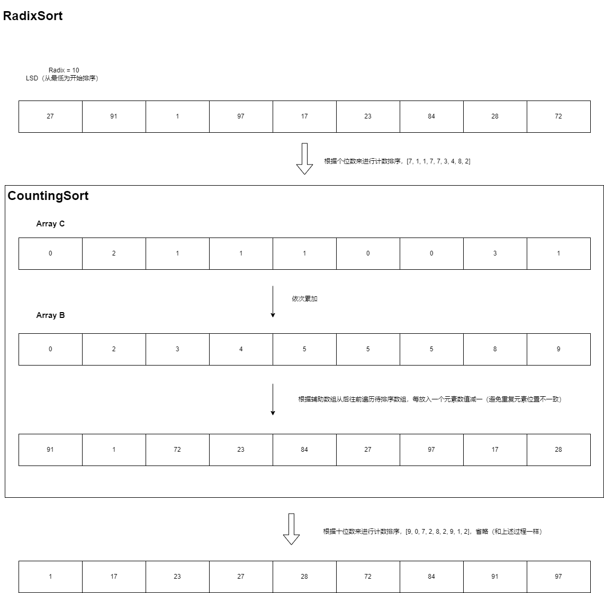

基数排序的过程：

1. 将所有待排序的元素转换为同样的进制数，并统一为同样的位数长度，再前面或后面补零和符号。
2. 然后，从最低位或最高位开始（根据LSD或MSD方法），将每个元素的当前位放入对应的桶中。
3. 接着，从所有桶中按顺序取出元素，并根据当前位进行稳定排序（可以使用计数排序或其他稳定排序算法）。
4. 重复上述过程，直到处理完所有的位数。
5. 最后，将所有元素转换回原来的进制数和形式（如果有必要），得到排序后的结果。

#### Comments

- 基数排序适用于数据范围较小，位数较多的整数序列。

- 基数排序运用了桶排序的思想，按照数字的每一位来分配桶，按照桶的顺序顺序收集元素，重复这个过程直到所有位数都处理完毕。
- 基数排序的时间复杂度是O(nd)，其中n是元素个数，d是最大元素的位数；空间复杂度是O(n+k)，其中k是进制位。基数排序是稳定的，不适用于负数和小数。
- BinSort是RadixSort的一种特例。BinSort 二进制排序，把数据转为二进制，分为0和1两个桶中。

计数排序的过程：

1. 找出待排序序列中的最大值和最小值
2. 统计序列中每个元素出现的次数，并将统计结果保存在一个计数数组中
3. 计算每个元素在有序序列中的位置，并将其存储在一个辅助数组中
4. 遍历待排序序列，按照辅助数组中的位置依次将元素放入有序序列中

#### Comments

- 计数排序的时间复杂度为O(n+k)，其中n是待排序序列的长度，k是序列中元素的取值范围。由于计数排序不需要进行元素之间的比较操作，因此它的时间复杂度比较低。
- 计数排序的优点是，它是一种稳定的排序算法，能够保证相同元素的相对位置不变。同时，计数排序的实现比较简单，容易理解和实现。计数排序的主要应用场景是在序列取值范围比较小的情况下，对序列进行排序。例如，对年龄、成绩等数据进行排序，计数排序是一种比较适合的算法。

过程如图所示：

------

关于代码，因为没有在SDUT中找到相关测试用例😅，所以就不写了，有需要可以后续再补充😊

