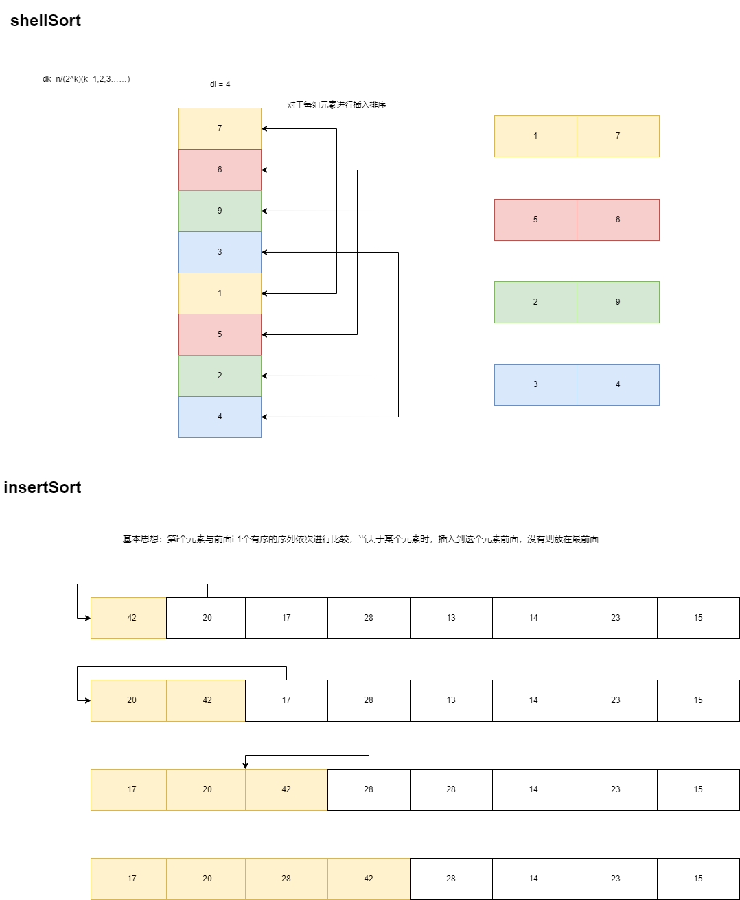

插入排序、希尔排序简化过程如下图所示，这里提供了两种代码实现。只要掌握了插入排序，希尔排序相当于分组进行插入排序。这里希尔排序的增量dk=n/(2^k)(k=1,2,3……)，最终增量为1时，则全部序列作为一个组进行插入排序。



insertSort:

```c++
void insertSortV1(int arr[], int n) {
    // 从第二个元素开始
    for (int i = 1; i < n; i++) {
        for (int j = i; j >= 1; j--) {
            // 后一个元素小于前一个元素，交换位置
            if(arr[j] < arr[j-1]) {
                swap(arr[j], arr[j-1]);
            } else {
                break;
            }
        }
    }
}
```

```cpp

void insertSortV2(int arr[], int n) {
    // 从第二个元素开始
    for (int i = 1; i < n; i++) {
        int temp = arr[i];
        int j = i - 1;
        // 有序序列中的元素向后移动一位，最后将临时变量放到插入位置上。当有序序列最后的元素小于当前元素时，直接结束。
        while(j >= 0 && arr[j] > temp) {
            arr[j+1] = arr[j];
            --j;
        }
        arr[j+1] = temp;
    }
}
```

#### Comments

两种方式都可以实现插入排序，但是第二种方式可能比前一种更快一些，因为第二种方式只需要移动有序数列的位置，不需要频繁进行交换操作。同样地，希尔排序也有对应的两种实现方式。

shellSort:

```cpp
void insertSort(int arr[], int di) {
    for (int i = di; i < n; i++) {
        int temp = arr[i];
        int j = i - di;
        while(j >= 0 && arr[j] > temp) {
            arr[j+di] = arr[j];
            j -= di;
        }
        arr[j+di] = temp;
    }
}

void shellSort(int arr[]) {
    // 从第二个元素开始
    int di = n / 2;
    while(di > 0) {
        insertSort(arr, di);
        di = di / 2;
    }
    
}
```

#### Comments

- 希尔排序实际上是插入排序的改进版，和插入排序一样，适用于数据序列基本有序的情况。
- 希尔排序适用于中等大小的数组，它比插入排序和选择排序要快得多，并且数组越大，优势越大。也适用于需要频繁排序的情况。
- 希尔排序时间复杂度取决于增量序列的选择，不同的增量序列会有不同的效率。时间复杂度O(nlogn) ~ O(n<sup>2</sup>)  空间复杂度O(1)
- 插入排序平均时间复杂度是O(n<sup>2</sup>)，最好情况是O(n)，最坏情况是O(n<sup>2</sup>)，空间复杂度O(1)
- 插入排序是稳定的，但是希尔排序是不稳定的。因为它会将相隔一定距离的元素进行比较和交换，可能会打乱原来相等元素的相对位置。也就是说，如果有两个相等的元素，它们在排序前后的顺序可能会改变。
- 上述只是基本的实现方式，可以进行优化。比如：可以使用二分查找法来寻找插入位置，这样可以减少比较次数，但是移动次数仍然不变。这种优化方法叫做折半插入排序。
